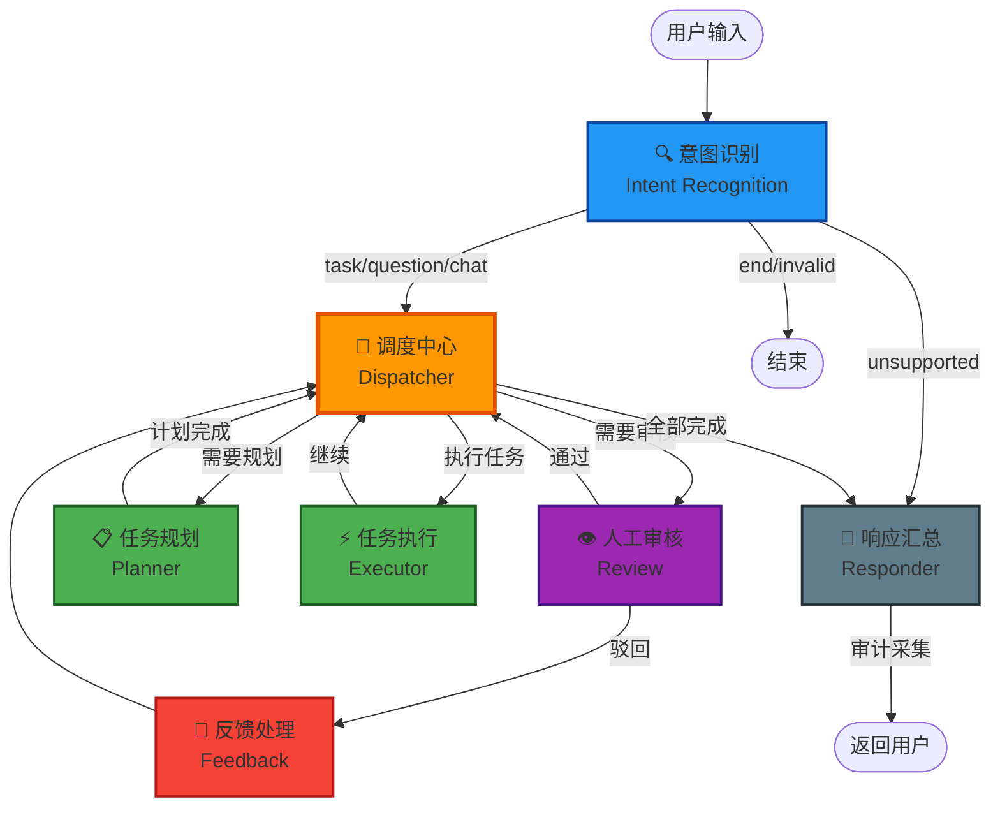

# NexusGraph — 工具优先的 AI Agent 编排框架

<p align="center">
  <strong>🔧 工具即能力，能力即涌现 🔧</strong>
</p>

<p align="center">
  <em>"多 Agent 系统的瓶颈不在于 Model 的智商，而在于 Tool 的治理。"</em>
</p>

---

## 🧭 核心思想

NexusGraph 是一个 **"工具优先 (Tool-First)"** 的 Agent 编排框架。

我们不迷信 AI 的端到端魔法，而是通过 **严格的工程约束**，将现有的业务系统转化为 AI 可理解、可控、安全的 **原子能力**。

> 一个 Agent 的智商再高，没有工具它就是一个困在盒子里的天才。
> NexusGraph 要做的，就是给这个天才一个 **精心策划的工具箱**。

---

## 🏛 三大设计支柱

### 1️⃣ 工具为底 (Tool-First Foundation)

> Agent 的能力边界由工具决定。

我们提供了一套标准化的 **Tool Card 协议**，将非结构化的 API 文档转化为 AI 友好的 **语义卡片**。每个 Tool Card 不仅仅是参数定义，更是一份给 LLM 看的 "自述文件"——它告诉 AI：**我能做什么、什么时候用我、怎么用我、用不了怎么办**。

**🌟 特色功能：Swagger to ToolCard**
一键将旧系统的 Swagger/OpenAPI 文档解析为 Agent 可用的 Tool Card，让遗留系统秒变 AI 技能。

### 2️⃣ 注册中心中心化 (Registry-Centric)

> 拒绝硬编码。所有的 Agent（身份）和 Tool（能力）都通过注册中心动态管理。

实现了 **Agent Card** 与 **Tool Card** 的 **解耦与动态绑定**，支持：

- 🔥 **热插拔**：工具和 Agent 的上/下线即时生效，无需重启。
- 🔒 **权限隔离**：基于用户角色的工具白名单，不同用户看到不同的工具集。
- 🔗 **动态绑定**：Agent 在运行时按需加载工具详情，实现渐进式注册。

### 3️⃣ 数据认知卸载 (Cognitive Offloading)

> 不要让昂贵的 LLM 做低级的 ETL。

NexusGraph 提倡在 **工具层** 进行数据预处理，向 AI 投喂 **"清洗后的结论"** 而非 **"原始数据"**，大幅降低 AI 的认知负荷与幻觉率。

例如：Bus Kernel 不会把一张 100 列的数据库表扔给 AI，而是通过 Tool Card 的 `output_schema` 定义，将数据 **预聚合、预过滤、语义标注** 后，再交给 Agent 处理。

---

## 🏗 系统架构总览

```
┌─────────────────────────────────────────────────────────────────────────┐
│                     DeciGro FE (Vue 3 + Element Plus)                   │
│                        💻 系统界面 — 人的眼睛与手                         │
│  ┌──────────┐  ┌──────────┐  ┌──────────┐  ┌──────────┐  ┌──────────┐ │
│  │ AI 对话  │  │ 工具管理 │  │Agent管理 │  │ 标签管理 │  │ 审计监控 │ │
│  └────┬─────┘  └────┬─────┘  └────┬─────┘  └────┬─────┘  └────┬─────┘ │
└───────┼─────────────┼─────────────┼─────────────┼─────────────┼───────┘
        │ HTTP        │ HTTP        │ HTTP        │ HTTP        │ HTTP
╔═══════╪═════════════╪═════════════╪═════════════╪═════════════╪═══════╗
║       ▼             ▼             ▼             ▼             ▼       ║
║  ┌─────────────────────────────────────────────────────────────────┐  ║
║  │              Bus Kernel (Spring Boot + PostgreSQL)               │  ║
║  │           ⚙️ 系统躯干 — 手脚 + 守门员 + 工具管家                  │  ║
║  │  ┌───────────────────────────────────────────────────────────┐  │  ║
║  │  │  📋 注册中心 (Registry Center)                             │  │  ║
║  │  │  ┌─────────────┐    ┌─────────────┐                       │  │  ║
║  │  │  │ Tool Cards  │◄──►│ Agent Cards │  动态绑定 & 热插拔     │  │  ║
║  │  │  │ (工具能力)  │    │ (智能体身份)│                        │  │  ║
║  │  │  └─────────────┘    └─────────────┘                       │  │  ║
║  │  └───────────────────────────────────────────────────────────┘  │  ║
║  │  ┌──────────┐ ┌──────────┐ ┌──────────┐ ┌──────────────────┐  │  ║
║  │  │权限守门员│ │会话管理  │ │审计存储  │ │ 业务数据服务      │  │  ║
║  │  │Token校验 │ │Session   │ │PG + ES  │ │ 标签/用户/角色等 │  │  ║
║  │  └──────────┘ └──────────┘ └──────────┘ └──────────────────┘  │  ║
║  └───────────────────────┬─────────────────────────────────────────┘  ║
║                          │ HTTP (API 调用)                            ║
║                          ▼                                            ║
║  ┌─────────────────────────────────────────────────────────────────┐  ║
║  │               AI Engine (FastAPI + LangGraph)                    │  ║
║  │              🧠 系统大脑 — 思考 + 规划 + 决策                      │  ║
║  │                                                                   │  ║
║  │  ┌─────────────────── LangGraph 工作流 ───────────────────────┐  │  ║
║  │  │                                                             │  │  ║
║  │  │  [意图识别] → [调度中心] → [任务规划] → [任务执行]          │  │  ║
║  │  │       │            │            │           │                │  │  ║
║  │  │       │            │            │      [人工审核]            │  │  ║
║  │  │       │            │            │           │                │  │  ║
║  │  │       └────────────┴────────────┴──→ [响应汇总] → END       │  │  ║
║  │  │                                                             │  │  ║
║  │  └─────────────────────────────────────────────────────────────┘  │  ║
║  │                                                                   │  ║
║  │  ┌──────────────┐  ┌──────────────┐  ┌──────────────────────┐   │  ║
║  │  │ ToolRegistry │  │AgentRegistry │  │  审计数据采集器      │   │  ║
║  │  │ (工具注册中心)│  │(Agent注册中心)│  │  (Async Collector)  │   │  ║
║  │  └──────────────┘  └──────────────┘  └──────────────────────┘   │  ║
║  └─────────────────────────────────────────────────────────────────┘  ║
╚══════════════════════════════════════════════════════════════════════╝
```

---

## 🎭 模块职能边界

NexusGraph 采用 **"大脑-躯干-界面"** 的仿生设计理念，每个模块职责清晰、边界分明：

| 模块                                        | 角色隐喻                     | 核心职责                                                   | 技术栈                                              |
| ------------------------------------------- | ---------------------------- | ---------------------------------------------------------- | --------------------------------------------------- |
| **🧠 [AI Engine](./ai-engine/README.md)**   | **系统大脑** — 思考者        | 意图识别、任务规划、Agent 编排、LLM 推理、审计埋点         | Python 3.12+, FastAPI, LangGraph, LangChain         |
| **⚙️ [Bus Kernel](./bus-kernel/README.md)** | **系统躯干** — 手脚 + 守门员 | 注册中心、权限守门、工具执行、数据服务、会话管理、审计存储 | Java 17, Spring Boot 3.2+, MyBatis-Flex, PostgreSQL |
| **💻 [DeciGro FE](./decigro-fe/README.md)** | **系统界面** — 眼睛与手      | AI 对话交互、工具/Agent 管理、标签管理、审计监控、系统管理 | Vue 3, TypeScript, Vite, Element Plus               |

### 职责边界详解

```
┌────────────────────────────────────────────────────────────────┐
│  🧠 AI Engine (大脑)                                           │
│  ✅ 负责：推理、决策、编排、Agent 调度                           │
│  ❌ 不负责：数据存储、权限校验、业务 CRUD                        │
│  原则：大脑只 "想"，不 "做"                                     │
├────────────────────────────────────────────────────────────────┤
│  ⚙️ Bus Kernel (躯干 + 守门员)                                  │
│  ✅ 负责：注册中心、工具执行、权限守门、数据服务、审计存储        │
│  ❌ 不负责：LLM 调用、意图识别、任务规划                         │
│  原则：躯干只 "做"，不 "想"；守门员只 "拦"，不 "抢"             │
├────────────────────────────────────────────────────────────────┤
│  💻 DeciGro FE (界面)                                          │
│  ✅ 负责：数据展示、用户交互、配置管理                           │
│  ❌ 不负责：业务逻辑、数据处理                                   │
│  原则：界面只 "看" 和 "传"，不 "算"                             │
└────────────────────────────────────────────────────────────────┘
```

---

## 🔄 注册中心中心化 — 实现原理

### 设计哲学

注册中心是 NexusGraph 的 **中枢神经系统**。它解决了一个核心问题：**如何让 AI 知道自己 "能做什么"？**

传统做法是在代码中硬编码工具列表，每次新增工具都需修改代码并重新部署。NexusGraph 将这个过程完全 **数据驱动化**：

```
传统方式：代码 → 注册 → AI 使用 (需重新部署)
NexusGraph：数据库 → API → AI 动态发现 (热插拔)
```

### 数据结构

注册中心基于 PostgreSQL 的两张核心表：

#### `tool_cards` — 工具能力注册表

```sql
tool_name          -- 唯一标识 (PK)，如 "get_all_customer_tags"
tool_description   -- AI 友好描述：做什么？何时用？约束是什么？
tool_protocol      -- 调用协议: "http" | "reference"
url_path           -- HTTP 工具的 API 端点
tool_parameters    -- JSONB: 入参定义（类型、描述、是否必填）
output_schema      -- JSONB: 出参定义（帮助 AI 解析结果）
tool_privileges    -- 权限级别: "public" | "protected"
tool_tags          -- JSONB: 标签分类
input_examples     -- JSONB: 少样本示例（辅助 Intent Detection）
output_examples    -- JSONB: 输出示例（帮助 AI 建立处理逻辑）
is_online          -- 上线状态开关
```

#### `agent_cards` — 智能体身份注册表

```sql
agent_name           -- 唯一标识 (PK)，如 "customer_service_bot"
agent_alias          -- 显示名称，如 "金牌客服小助手"
agent_description    -- 职责描述
system_prompt        -- 系统提示词（核心指令集）
negative_prompt      -- 负向提示词（不应该做什么）
reasoning_framework  -- 推理框架: "ReAct" | "PlanSolve"
bound_tools          -- JSONB: 绑定工具白名单
agent_tags           -- JSONB: 能力标签
is_online            -- 上线状态开关
```

### 渐进式加载策略

注册中心采用 **两阶段渐进式加载**，避免一次性加载所有数据：

```
阶段一：摘要加载 (Summary Load)
┌─────────┐    POST /tool/available     ┌─────────────┐
│AI Engine│ ─────────────────────────► │ Bus Kernel  │
│         │ ◄───────────────────────── │ (权限过滤)  │
└─────────┘    返回: [name, desc, tags] └─────────────┘
               仅加载元数据，用于意图识别和任务规划

阶段二：详情加载 (Detail Load) — 按需触发
┌─────────┐    POST /tool/detail        ┌─────────────┐
│AI Engine│ ─────────────────────────► │ Bus Kernel  │
│         │ ◄───────────────────────── │ (权限校验)  │
└─────────┘    返回: 完整 Tool Card      └─────────────┘
               仅在 Executor 需要调用时加载
```

---

## ⚡ 工具与 Agent Card 的注册和使用全过程

### 完整自动化流程

```
 ① 管理员配置阶段                        ② 用户对话阶段
 ─────────────────                       ──────────────────────────────

 📋 管理员在前端                          👤 用户发送消息
    配置 Tool Card                            │
        │                                     ▼
        ▼                               ┌──────────────┐
 ┌──────────────┐                       │  AI Engine    │
 │  Bus Kernel  │                       │  意图识别节点 │◄── 注册中心摘要
 │  保存到 PG   │                       └──────┬───────┘    (Tool + Agent)
 │  tool_cards  │                              │
 └──────────────┘                              ▼
        │                               ┌──────────────┐
        │ 即时生效                       │  Planner     │
        ▼                               │  任务规划节点 │◄── 注册中心摘要
 ┌──────────────┐                       └──────┬───────┘
 │  AI Engine   │                              │
 │ ToolRegistry │                              ▼
 │  下次请求    │                       ┌──────────────┐
 │  自动发现    │                       │  Dispatcher  │
 └──────────────┘                       │  调度中心节点 │◄── 选择 Agent
                                        └──────┬───────┘
 📋 管理员配置                                  │
    Agent Card                                  ▼
        │                               ┌──────────────┐
        ▼                               │  Executor    │
 ┌──────────────┐                       │  任务执行节点 │
 │  Bus Kernel  │                       │              │
 │  保存到 PG   │                       │ ① AgentRegistry.get_agent()
 │ agent_cards  │                       │    加载 Agent 详情 (含 system_prompt)
 └──────────────┘                       │              │
                                        │ ② ToolRegistry.get_tool()
                                        │    按需加载工具详情
                                        │    动态构建 StructuredTool
                                        │              │
                                        │ ③ LLM + Tool Calling
                                        │    Agent 使用工具执行任务
                                        │              │
                                        │ ④ 工具通过 HTTP 调用
                                        │    Bus Kernel 业务 API
                                        └──────┬───────┘
                                               │
                                               ▼
                                        ┌──────────────┐
                                        │  Responder   │
                                        │  响应汇总节点 │
                                        │  + 审计采集   │
                                        └──────┬───────┘
                                               │
                                               ▼
                                          💬 返回用户
```

### 关键流程说明

| 步骤         | 触发者         | 动作                                      | 数据流                             |
| ------------ | -------------- | ----------------------------------------- | ---------------------------------- |
| ① 注册 Tool  | 管理员         | 前端填写 Tool Card 表单 → Bus Kernel 保存 | FE → Bus Kernel → PostgreSQL       |
| ② 注册 Agent | 管理员         | 前端填写 Agent Card → 绑定工具列表        | FE → Bus Kernel → PostgreSQL       |
| ③ 上线       | 管理员         | 点击"上线"按钮                            | `is_online = true`，即时生效       |
| ④ 发现       | AI Engine      | 首次请求时自动加载摘要                    | Bus Kernel API → ToolRegistry 缓存 |
| ⑤ 规划       | Planner        | 基于摘要选择所需工具和 Agent              | ToolRegistry + AgentRegistry       |
| ⑥ 执行       | Executor       | 按需加载工具详情并构建 StructuredTool     | Bus Kernel API → ToolFactory       |
| ⑦ 调用       | StructuredTool | 通过 HTTP 调用 Bus Kernel 业务 API        | AI Engine → Bus Kernel             |
| ⑧ 审计       | Responder      | 异步提交执行快照                          | AI Engine → Bus Kernel → PG + ES   |

---

## 🧠 LangGraph 工作流架构



### 七大核心节点

| 节点            | 文件                         | 职责                                                                     | 使用的 LLM 能力                           |
| --------------- | ---------------------------- | ------------------------------------------------------------------------ | ----------------------------------------- |
| **🔍 意图识别** | `intent_recognition_node.py` | 解析用户输入，判断意图类型（task/question/chat/clarify/unsupported/end） | `with_structured_output` → `IntentObject` |
| **📡 调度中心** | `dispatcher_node.py`         | 路由决策 + Agent 选择，是整个图的"交通枢纽"                              | LLM Agent 匹配选择                        |
| **📋 任务规划** | `planner_node.py`            | 将复杂需求拆解为有序步骤（Chain-of-Thought）                             | `with_structured_output` → `PlanOutput`   |
| **⚡ 任务执行** | `plan_task_execute_node.py`  | 加载 Agent + 工具，执行 Tool Calling 循环                                | LLM + StructuredTool binding              |
| **👁 人工审核** | `human_review_node.py`       | 敏感操作的"中断-恢复"机制                                                | 无（纯状态管理）                          |
| **🔄 反馈处理** | `feedback_handler_node.py`   | 处理审核驳回的反馈，调整或重新规划                                       | 关键词分析                                |
| **📝 响应汇总** | `responder_node.py`          | 汇总执行结果 + 触发审计数据采集                                          | 无（结果聚合）                            |

---

## 📊 全链路审计追踪

NexusGraph 实现了从用户提问到 AI 回复的 **全链路可观测**：

```
用户请求 → 意图识别 → 任务规划 → Agent 选择 → 工具调用 → 返回结果
    │           │           │           │           │           │
    ▼           ▼           ▼           ▼           ▼           ▼
 trace_id   node_trace  node_trace  node_trace  tool_snap   audit_save
    │           │           │           │           │           │
    └───────────┴───────────┴───────────┴───────────┴───────────┘
                              │
                ┌─────────────┴─────────────┐
                │        Responder          │
                │   异步提交到 Bus Kernel    │
                └─────────────┬─────────────┘
                              │
                    ┌─────────┴─────────┐
                    │                   │
                    ▼                   ▼
            ┌──────────────┐   ┌──────────────┐
            │  PostgreSQL  │   │Elasticsearch │
            │  宽表索引    │   │  完整快照     │
            │  (列表查询)  │   │  (详情钻取)  │
            └──────────────┘   └──────────────┘
```

- **PG 宽表** (`ai_chat_trace_index`): 存储摘要数据，支持多维度筛选（trace_id, task_id, user_id, agent_name, status, tools_used 等）
- **ES 文档**: 存储完整快照（graph_nodes → agent_snapshots → tools_snapshot），支持详情钻取

---

## 🚀 快速开始

### 环境要求

| 依赖              | 版本    | 说明                 |
| ----------------- | ------- | -------------------- |
| **Java**          | JDK 17+ | Bus Kernel 运行环境  |
| **Python**        | 3.12+   | AI Engine 运行环境   |
| **Node.js**       | v20.0+  | 前端构建环境         |
| **PostgreSQL**    | 17+     | 核心数据存储         |
| **Redis**         | 7.0+    | Token 缓存、会话管理 |
| **Elasticsearch** | 8.x     | 审计详情存储（可选） |

### 一键启动

```bash
# 初始化数据库
psql -U postgres -f scripts/init.sql
psql -U postgres -f docs/db-design/db.sql

# 启动所有服务
./scripts/start.sh

# 或重启（含编译）
./scripts/restart.sh
```

### 分模块启动

```bash
# 1. Bus Kernel (Java)
cd bus-kernel
mvn clean package -DskipTests
java -jar target/bus-kernel-*.jar

# 2. AI Engine (Python)
cd ai-engine
uv sync
uv run uvicorn src.ai_engine.main:app --reload --port 8001

# 3. DeciGro FE (Node.js)
cd decigro-fe
npm install
npm run dev
```

### 访问地址

| 服务                   | 地址                                         | 说明                   |
| ---------------------- | -------------------------------------------- | ---------------------- |
| **前端**               | http://localhost:5173                        | Vue 管理后台 + AI 对话 |
| **Bus Kernel API**     | http://localhost:8080/api/dg                 | Java 业务服务          |
| **Bus Kernel Swagger** | http://localhost:8080/api/dg/swagger-ui.html | API 文档               |
| **AI Engine API**      | http://localhost:8001                        | Python AI 服务         |
| **AI Engine Docs**     | http://localhost:8001/docs                   | FastAPI 文档           |

---

## 📂 项目结构

```
ifc-ai-decigro-center/
├── ai-engine/              # 🧠 AI 引擎 (Python)
│   ├── src/ai_engine/
│   │   ├── main.py         # FastAPI 应用入口
│   │   ├── config.py       # 配置管理
│   │   ├── api/            # API 路由 + BusKernel 客户端
│   │   ├── registry/       # ToolRegistry + AgentRegistry
│   │   ├── tools/          # 动态工具工厂 (ToolCard → StructuredTool)
│   │   ├── graph/          # LangGraph 工作流
│   │   │   ├── state.py    # 状态定义 (AgentState)
│   │   │   ├── builder.py  # 图构建器
│   │   │   └── nodes/      # 7 个核心节点
│   │   └── audit/          # 审计数据采集器
│   └── pyproject.toml      # 项目配置
│
├── bus-kernel/             # ⚙️ 业务内核 (Java)
│   └── src/main/java/
│       └── com/ifc/decigro/buskernel/
│           ├── controller/ # 14 个 REST Controller
│           ├── service/    # 业务逻辑层
│           ├── entity/     # 数据实体 (含 ToolCard, AgentCard)
│           ├── mapper/     # MyBatis-Flex 数据访问
│           ├── common/     # 通用组件 (Auth, Filter, Crypto)
│           ├── config/     # 配置类
│           └── dto/        # 数据传输对象
│
├── decigro-fe/             # 💻 前端 (Vue 3)
│   └── src/
│       ├── views/          # 页面视图
│       │   ├── chat/       # AI 智能对话
│       │   ├── tool/       # 工具管理
│       │   ├── agent/      # 智能体管理
│       │   ├── tag/        # 标签管理
│       │   ├── audit/      # 审计监控
│       │   └── system/     # 系统管理 (用户/角色/部门/租户)
│       ├── router/         # 路由配置
│       ├── stores/         # Pinia 状态管理
│       └── layout/         # 布局组件
│
├── scripts/                # 运维脚本
│   ├── init.sql            # 数据库初始化
│   ├── init_es_mapping.sh  # ES 索引映射初始化
│   ├── start.sh            # 启动脚本
│   └── restart.sh          # 重启脚本 (含编译)
│
└── docs/                   # 项目文档
    ├── db-design/          # 数据库设计
    ├── prd/                # 产品需求文档
    └── sql/                # SQL 脚本
```

---

## 🔮 设计理念总结

> **工具即能力，能力即涌现。**

在 NexusGraph 中：

- 每一个 **Tool Card** 是一个原子能力
- 每一个 **Agent Card** 是一组能力的编排方案
- **注册中心** 是能力的目录和守门员
- **LangGraph** 是能力的编排引擎
- 当工具足够丰富、Agent 足够专业时，系统的 **智能涌现** 就自然发生

我们相信：**AI 不需要无所不能，它只需要知道该用什么工具、怎么用好它。**

---

_Copyright © 2026 IFC AI DeciGro Center Team. Built with ❤️ and NexusGraph._
