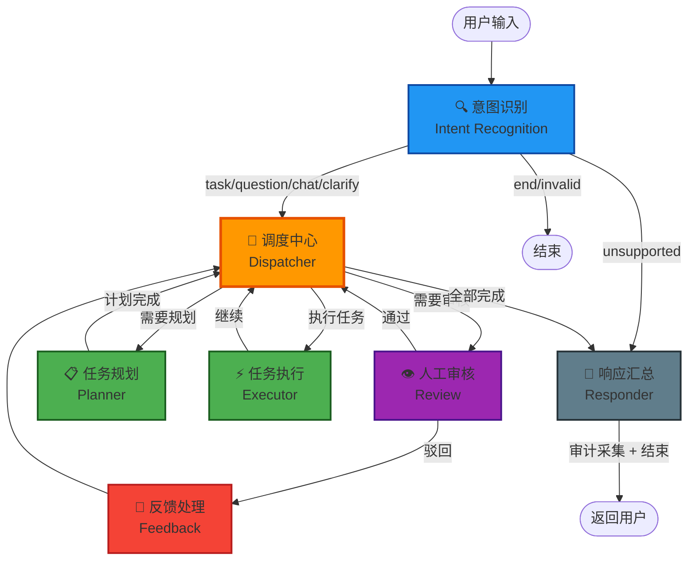

# 🧠 AI Engine — 多智能体编排引擎

> **系统大脑**：只 "想"，不 "做"。负责推理、决策、编排。

## 概述

基于 **LangGraph** 的多智能体编排引擎（Multi-Agent Orchestration Engine），采用 **Plan-and-Execute** 范式和 **辐射型（Hub-and-Spoke）** 架构。

AI Engine 是 NexusGraph 系统的"大脑" —— 它接收用户的自然语言输入，通过意图识别、任务规划、Agent 调度和工具调用，完成复杂的业务任务，最终以自然语言将结果返回给用户。

### 核心原则

- **不直连数据库**：所有数据通过 Bus Kernel API 获取（Token 透传）
- **不做业务逻辑**：业务执行由 Bus Kernel 的工具 API 完成
- **不硬编码工具**：所有工具和 Agent 通过注册中心动态发现
- **全链路可追踪**：每个节点都有审计埋点，结果异步提交到 Bus Kernel

---

## 技术栈

| 技术          | 版本   | 用途                           |
| ------------- | ------ | ------------------------------ |
| **Python**    | 3.12+  | 编程语言                       |
| **FastAPI**   | 0.115+ | Web 框架                       |
| **LangChain** | 0.3+   | LLM 应用框架                   |
| **LangGraph** | 0.2+   | Agent 工作流编排               |
| **Pydantic**  | 2.10+  | 数据验证与结构化输出           |
| **httpx**     | 0.27+  | HTTP 客户端（调用 Bus Kernel） |
| **uv**        | latest | 包管理工具                     |

---

## 系统架构

### LangGraph 工作流



### 节点详解

#### 1. 🔍 意图识别节点 (`intent_recognition_node.py`)

**职责**：解析用户输入，判断意图类型并提取关键信息。

- 使用 `with_structured_output(IntentObject)` 保证 LLM 返回结构化结果
- Prompt 中动态注入当前用户 **可用的 Tool Card 和 Agent Card 摘要**
- 支持 7 种意图类型：`task` | `question` | `chat` | `clarify` | `unsupported` | `invalid` | `end`
- `unsupported` 意图直接路由到 Responder 生成引导语

#### 2. 📡 调度中心节点 (`dispatcher_node.py`)

**职责**：整个图的"交通枢纽"，负责路由决策和 Agent 选择。

- 根据当前状态决定下一步路由：`planner` → `executor` → `review` → `responder`
- 使用 LLM 为每个执行步骤 **智能选择最合适的 Agent**
- Agent 选择 Prompt 内置调度原则：专项优先、通用回退

#### 3. 📋 任务规划节点 (`planner_node.py`)

**职责**：将复杂需求拆解为有序的执行步骤。

- 使用 `with_structured_output(PlanOutput)` 输出结构化计划
- 生成的 `PlanStep` 包含：步骤描述、指定 Agent、预期工具、依赖关系、审核标记
- 支持人机协同：关键步骤可标记 `requires_review = true`

#### 4. ⚡ 任务执行节点 (`plan_task_execute_node.py`)

**职责**：加载 Agent 配置和工具，执行 LLM Tool Calling 循环。

- 从 `AgentRegistry` 获取 Agent 完整配置（system_prompt, bound_tools 等）
- 从 `ToolRegistry` 按需加载工具详情，动态构建 `StructuredTool`
- 内置 Tool Calling 循环（最大 5 轮迭代），处理 LLM 的多轮工具调用
- 每次工具调用都生成 `tool_snapshot`，记录入参、出参和耗时

#### 5. 👁 人工审核节点 (`human_review_node.py`)

**职责**：敏感操作的"中断-恢复"机制。

- 使用 LangGraph 的 `interrupt_before` 机制暂停工作流
- 生成审核上下文（当前步骤、已调用工具、执行输出）
- 通过 API `POST /review/{task_id}` 恢复执行

#### 6. 🔄 反馈处理节点 (`feedback_handler_node.py`)

**职责**：处理审核驳回后的反馈。

- 分析反馈内容，决定 **重新规划** 还是 **调整当前步骤**
- 如需重新规划，清空计划并保留反馈给 Planner 参考

#### 7. 📝 响应汇总节点 (`responder_node.py`)

**职责**：汇总执行结果，生成最终响应，触发审计采集。

- 提取最后一个 StepResult 的输出作为回复
- 处理 `unsupported` 意图的引导语
- 异步提交审计数据到 Bus Kernel（后台线程，不阻塞主流程）

---

## 核心模块

### 注册中心 (`registry/`)

#### ToolRegistry — 工具注册中心

```python
# 全局单例，通过 get_tool_registry() 获取
registry = get_tool_registry()

# 阶段一：加载摘要（首次请求时自动触发）
registry.load(token)  # POST /tool/available → 获取用户可用工具列表

# 阶段二：按需获取工具（执行时自动触发）
tool = registry.get_tool("get_all_customer_tags", token)
# POST /tool/detail → 获取完整 Tool Card → ToolFactory 构建 StructuredTool
```

**关键特性**：

- 基于 Token 的用户隔离（不同用户看到不同工具集）
- 两级缓存：用户级摘要缓存 + 全局卡片缓存
- 支持热更新：`reload(token)` 清除缓存并重新加载

#### AgentRegistry — Agent 注册中心

```python
registry = get_agent_registry()

# 加载可用 Agent 列表
registry.load(token)  # POST /agent/available

# 获取 Agent 完整配置
agent_config = registry.get_agent("customer_service_bot", token)
# POST /agent/detail → AgentConfig 封装

# Agent 工具绑定规则
# bound_tools = None  → 使用所有可用工具（通用 Agent）
# bound_tools = []    → 不使用任何工具（纯对话模式）
# bound_tools = [...]  → 仅使用指定工具（专项 Agent）
tools = agent_config.get_tools(token)
```

### 动态工具工厂 (`tools/factory.py`)

将 Tool Card 的 JSON 定义 **动态转换** 为 LangChain `StructuredTool`：

```
Tool Card (JSON from DB)
    ↓
create_pydantic_model_from_params()  →  动态 Pydantic Model (参数验证)
    ↓
create_http_executor()               →  HTTP 执行器 (调用 Bus Kernel API)
    ↓
StructuredTool                        →  LLM 可调用的标准工具
```

支持两种工具协议：

- **`http`**：通过 HTTP 调用 Bus Kernel REST API
- **`reference`**：本地引用（预留扩展）

### 审计数据采集 (`audit/`)

#### 轻量级埋点工具 (`trace_utils.py`)

每个节点仅需 **2~3 行代码** 完成追踪：

```python
# 节点开始
nt = start_node_trace("intent_recognition")

# ...执行逻辑...

# 节点结束（附带 Agent 快照）
finish_node_trace(nt, "SUCCESS", agent_snapshot=snap, node_result="...")
```

#### 异步提交 (`collector.py`)

- 在 `responder_node` 结束时触发
- 使用 **后台守护线程** 异步提交，不阻塞主流程
- 构建两份数据：
  - **PG 宽表** (`traceIndex`): 摘要索引，用于列表查询
  - **ES 快照** (`esSnapshot`): 完整执行堆栈，用于详情钻取

### BusKernel 客户端 (`api/bus_kernel_client.py`)

与 Bus Kernel 通信的统一 HTTP 客户端：

| 方法                     | API 端点                | 用途                         |
| ------------------------ | ----------------------- | ---------------------------- |
| `get_available_agents()` | `POST /agent/available` | AI 加载阶段：获取 Agent 摘要 |
| `get_agent_detail()`     | `POST /agent/detail`    | AI 调用阶段：获取 Agent 详情 |
| `get_available_tools()`  | `POST /tool/available`  | AI 加载阶段：获取工具摘要    |
| `get_tool_detail()`      | `POST /tool/detail`     | AI 调用阶段：获取工具详情    |

所有请求自动携带 `X-Auth-Token`，实现用户级权限透传。

---

## API 接口

### 发起任务

```bash
POST /api/v1/workflow/chat
X-Auth-Token: <user_token>
Content-Type: application/json

{
    "query": "帮我查询所有客户标签",
    "user_id": "admin",
    "session_id": "session_abc123"
}
```

### 获取待审核任务

```bash
GET /api/v1/workflow/pending_reviews
```

### 提交审核结果

```bash
POST /api/v1/workflow/review/{task_id}
Content-Type: application/json

{
    "action": "approve",  // 或 "reject"
    "feedback": "审核反馈内容"
}
```

---

## 目录结构

```
ai-engine/
├── pyproject.toml              # 项目配置 & 依赖管理
├── .env.example                # 环境变量示例
├── README.md                   # 本文档
├── src/
│   └── ai_engine/
│       ├── __init__.py
│       ├── main.py             # FastAPI 应用入口 + 生命周期管理
│       ├── config.py           # Pydantic Settings 配置管理
│       │
│       ├── api/                # API 层
│       │   ├── routes.py       # 工作流 API 端点定义
│       │   └── bus_kernel_client.py  # Bus Kernel HTTP 客户端
│       │
│       ├── registry/           # 注册中心
│       │   ├── tool_registry.py    # 工具注册中心 (渐进式加载)
│       │   └── agent_registry.py   # Agent 注册中心 (渐进式加载)
│       │
│       ├── tools/              # 工具工厂
│       │   └── factory.py      # ToolCard → StructuredTool 转换器
│       │
│       ├── graph/              # LangGraph 核心
│       │   ├── state.py        # AgentState + Pydantic 模型定义
│       │   ├── builder.py      # StateGraph 构建器 (含 interrupt_before)
│       │   └── nodes/          # 7 个核心节点
│       │       ├── intent_recognition_node.py  # 意图识别
│       │       ├── dispatcher_node.py          # 调度中心
│       │       ├── planner_node.py             # 任务规划
│       │       ├── plan_task_execute_node.py    # 任务执行
│       │       ├── human_review_node.py        # 人工审核
│       │       ├── feedback_handler_node.py    # 反馈处理
│       │       └── responder_node.py           # 响应汇总
│       │
│       └── audit/              # 审计模块
│           ├── trace_utils.py  # 轻量级节点埋点工具
│           └── collector.py    # 异步审计数据采集器
```

---

## 快速开始

### 1. 环境配置

```bash
cp .env.example .env
# 编辑 .env：配置 LLM API Key、Bus Kernel 地址等
```

### 2. 安装依赖

```bash
uv sync
```

### 3. 启动服务

```bash
uv run uvicorn src.ai_engine.main:app --reload --port 8001
```

### 4. 访问 API 文档

- **Swagger UI**: http://localhost:8001/docs
- **ReDoc**: http://localhost:8001/redoc

---

## 状态模型 (AgentState)

核心状态字段一览：

| 字段                 | 类型                | 说明                                |
| -------------------- | ------------------- | ----------------------------------- |
| `query`              | `str`               | 用户原始输入                        |
| `user_id`            | `str`               | 用户标识                            |
| `session_id`         | `str`               | 会话标识                            |
| `task_id`            | `str`               | 任务标识                            |
| `trace_id`           | `str`               | 链路追踪 ID                         |
| `token`              | `str`               | 用户认证 Token（透传到 Bus Kernel） |
| `intent`             | `IntentObject`      | 意图识别结果                        |
| `plan`               | `list[PlanStep]`    | 执行计划步骤列表                    |
| `current_step_index` | `int`               | 当前执行步骤索引                    |
| `step_results`       | `list[StepResult]`  | 步骤执行结果列表                    |
| `selected_agent`     | `str`               | 当前选择的 Agent 名称               |
| `require_review`     | `bool`              | 是否需要人工审核                    |
| `review_status`      | `ReviewStatus`      | 审核状态                            |
| `node_traces`        | `list[dict]`        | 图节点执行追踪记录列表              |
| `messages`           | `list[BaseMessage]` | LangGraph 消息列表                  |

---

## 与 Bus Kernel 的集成

AI Engine 通过 HTTP API 与 Bus Kernel 通信，**全程 Token 透传**：

```
AI Engine                         Bus Kernel
    │                                 │
    │── POST /tool/available ───────►│  获取用户可用工具列表
    │◄── [摘要列表] ─────────────────│
    │                                 │
    │── POST /agent/available ──────►│  获取可用 Agent 列表
    │◄── [摘要列表] ─────────────────│
    │                                 │
    │── POST /tool/detail ──────────►│  获取工具详情 (执行时)
    │◄── [完整 Tool Card] ──────────│
    │                                 │
    │── HTTP (工具调用) ────────────►│  执行业务 API
    │◄── [业务结果] ────────────────│
    │                                 │
    │── POST /trace/save ───────────►│  提交审计数据
    │                                 │
```
