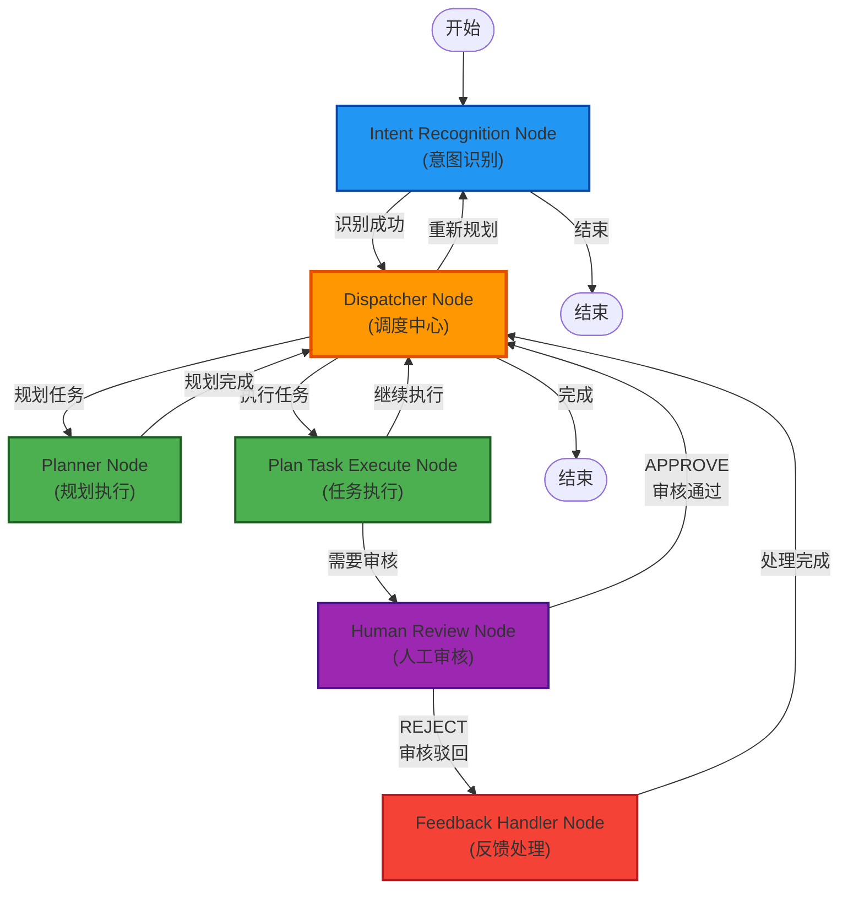

# AI 引擎 (AI Engine)

## 概述

基于 LangGraph 的多智能体编排引擎 (Multi-Agent Orchestration Engine)，采用 **Plan-and-Execute** 范式和 **辐射型 (Hub-and-Spoke)** 架构。

## 核心特性

- **动态注册机制**：通过数据库 (`agent_cards`, `tool_cards`) 定义 Agent 和工具，支持热插拔
- **Plan-and-Execute**：自动拆解复杂任务为有序步骤
- **人机协同**：内置人工审核节点，支持敏感操作的"中断-恢复"机制
- **状态持久化**：使用 LangGraph Checkpointer 保存执行状态

## 技术栈

| 技术              | 版本   | 用途             |
| ----------------- | ------ | ---------------- |
| **Python**        | 3.12+  | 编程语言         |
| **FastAPI**       | 0.115+ | Web 框架         |
| **LangChain**     | 0.3+   | LLM 应用框架     |
| **LangGraph**     | 0.2+   | Agent 工作流编排 |
| **psycopg**       | 3.2+   | PostgreSQL 驱动  |
| **Pydantic**      | 2.9+   | 数据验证         |
| **python-dotenv** | 1.0+   | 环境变量管理     |

## 系统架构



## 快速开始

### 1. 环境配置

```bash
# 复制环境变量配置
cp .env.example .env

# 编辑 .env 文件，配置以下内容：
# - DATABASE_URL: PostgreSQL 连接字符串
# - LLM_API_KEY: LLM API 密钥
# - LLM_MODEL: 模型名称
```

### 2. 安装依赖

```bash
# 使用 uv 安装依赖
uv sync

# 或使用 pip
pip install -e .
```

### 3. 启动服务

```bash
# 开发模式
uv run uvicorn src.ai_engine.main:app --reload --port 8001

# 或直接运行
uv run python -m src.ai_engine.main
```

### 4. 访问 API 文档

- **Swagger UI**: http://localhost:8001/docs
- **ReDoc**: http://localhost:8001/redoc

## API 接口

### 发起任务

```bash
POST /api/v1/workflow/chat
Content-Type: application/json

{
    "query": "帮我查询北京的天气",
    "user_id": "u123",
    "session_id": "s_abc_123"
}
```

### 获取待审核任务

```bash
GET /api/v1/workflow/pending_reviews
```

### 提交审核结果

```bash
POST /api/v1/workflow/review/{thread_id}
Content-Type: application/json

{
    "action": "approve",  // 或 "reject"
    "feedback": "审核反馈内容"
}
```

## 目录结构

```
ai-engine/
├── pyproject.toml          # 项目配置
├── .env.example            # 环境变量示例
├── README.md               # 本文档
├── src/
│   └── ai_engine/
│       ├── __init__.py
│       ├── main.py         # FastAPI 应用入口
│       ├── config.py       # 配置管理
│       ├── db/             # 数据库模块
│       │   ├── __init__.py
│       │   └── manager.py
│       ├── registry/       # 注册中心
│       │   ├── __init__.py
│       │   ├── tool_registry.py
│       │   └── agent_registry.py
│       ├── tools/          # 工具模块
│       │   ├── __init__.py
│       │   └── factory.py
│       ├── graph/          # LangGraph 核心
│       │   ├── __init__.py
│       │   ├── state.py
│       │   ├── builder.py
│       │   └── nodes/      # 节点实现
│       │       ├── intent.py
│       │       ├── dispatcher.py
│       │       ├── planner.py
│       │       ├── executor.py
│       │       ├── review.py
│       │       └── feedback.py
│       └── api/            # API 路由
│           ├── __init__.py
│           └── routes.py
└── tests/                  # 测试
    ├── __init__.py
    ├── test_registry.py
    └── test_graph.py
```

## 运行测试

```bash
# 运行所有测试
uv run pytest tests/ -v

# 运行特定测试
uv run pytest tests/test_registry.py -v
```

## 与 Bus Kernel 集成

AI Engine 通过 HTTP 调用 Bus Kernel 提供的工具 API：

1. **Tool Cards**: 从 `tool_cards` 表读取工具定义
2. **Agent Cards**: 从 `agent_cards` 表读取 Agent 配置
3. **HTTP 工具**: 调用 Bus Kernel 的 REST API 执行业务操作

配置 `BUS_KERNEL_BASE_URL` 环境变量指向 Bus Kernel 服务地址。
