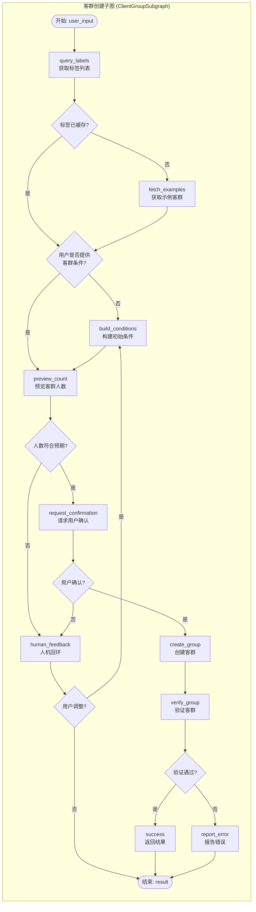
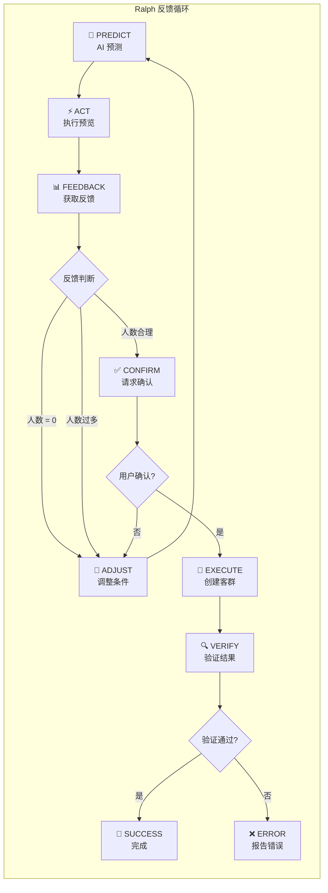
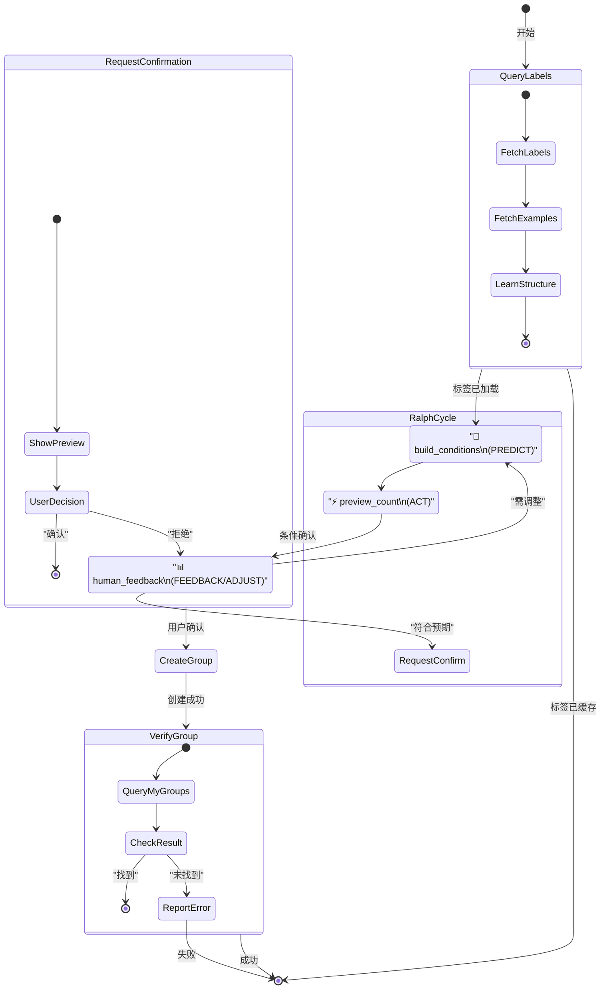
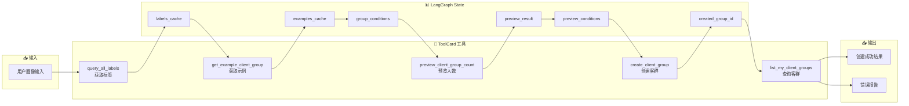
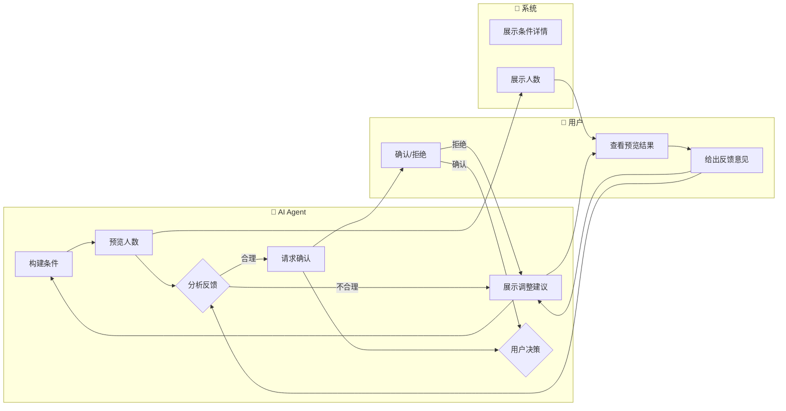
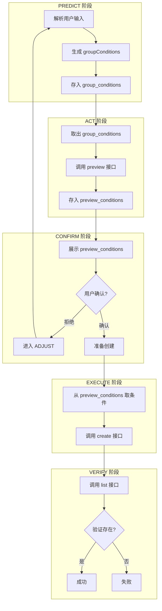

# 客群创建子图 PRD - 基于 LangGraph Ralph 反馈循环

## 1. 概述

### 1.1 文档目的

本文档定义了基于 LangGraph Subgraph 架构的**客群创建子图**的产品需求与设计规范。该子图通过 Ralph 反馈循环（Predict-Act-Feedback-Adjust）实现 AI Agent 与用户的协同交互，确保客群创建过程的可控性与准确性。

### 1.2 设计背景

当前 AI-Native 客群接口已通过 ToolCard 注解暴露了 5 个核心工具，AI Agent 可以独立调用完成客群创建。然而，缺少统一的流程编排与状态管理，导致：
- AI 可能跳过关键验证步骤直接创建
- 用户无法有效介入确认环节
- 条件构建错误时缺乏有效的回退机制

通过 LangGraph Subgraph 将这些工具编排为有状态的反馈循环，可实现：
- 流程强制执行（每步必达）
- 人机回环（Human-in-the-loop）
- 状态持久化与条件一致性保证

### 1.3 核心工具清单
核心输入 和 核心输出 均来自tool_registry的注册信息

| 工具名称 | 功能 | HTTP方法 | 核心输入 | 核心输出 |
|---------|------|---------|---------|---------|
| `query_all_labels` | 获取所有可用标签 | GET | 无 | 标签列表（field、valueType、supportedOperators、enumOptions） |
| `get_example_client_group` | 获取示例客群配置 | GET | 无 | 示例客群详情（含 groupConditions 结构） |
| `preview_client_group_count` | 预览客群人数 | POST | groupConditions | 人数描述字符串 |
| `create_client_group` | 创建客群 | POST | name、remark、groupConditions | clientGroupId |
| `list_my_client_groups` | 查询用户客群列表 | GET | limit | 客群列表 |


### 1.4 子图触发条件：当规划者根据用户需求判定需要进行创建客群操作时，将该子图插入到PlanStep中，并进行触发
planner必须要先知道子图的信息 **ai_client_group_creater（智能客群生成专家）** 子图
描述信息： 智能客群生成专家专用于将业务需求转化为系统规则，并实际落地创建目标客群。其特点是严格遵循“查询标签字典 -> 预览客群规模 -> 正式创建客群”的强制工作流，确保规则100%合法。具备强大的“2次报错熔断”自愈机制，遇挫会自动调取标准示例对比重构。当用户需要根据标签、条件圈选并最终生成、落地一个真实客群实体时，必须调用此专家。

---

## 2. Ralph 反馈循环设计

### 2.1 Ralph 循环原理

Ralph 反馈循环是一种人机协同的决策框架，通过四个阶段的循环迭代实现最优决策：

```
┌─────────────────────────────────────────────────────────────┐
│                                                             │
│    ┌─────────┐    ┌─────────┐    ┌─────────┐    ┌─────────┐ │
│    │ PREDICT │───▶│   ACT   │───▶│ FEEDBACK│───▶│ ADJUST  │ │
│    └─────────┘    └─────────┘    └─────────┘    └─────────┘ │
│         ▲                                           │       │
│         │              Ralph Feedback Loop         │       │
│         └───────────────────────────────────────────┘       │
│                                                             │
└─────────────────────────────────────────────────────────────┘
```

| 阶段 | 含义 | 在客群场景的映射 |
|------|------|-----------------|
| **Predict** | AI 基于输入预测输出 | AI 根据用户画像推断客群条件 |
| **Act** | 执行动作验证预测 | 调用 preview_client_group_count 预览人数 |
| **Feedback** | 获取反馈结果 | 获取人数是否符合预期 |
| **Adjust** | 根据反馈调整策略 | 若不符合，修改条件重新预测 |

### 2.2 客群创建中的 Ralph 循环

```
┌──────────────────────────────────────────────────────────────────────┐
│                                                                      │
│  ┌────────────────┐                                                   │
│  │   1. 预测阶段   │  AI 基于用户画像 + 标签知识，构建 groupConditions  │
│  │   PREDICT      │                                                   │
│  └───────┬────────┘                                                   │
│          │                                                            │
│          ▼                                                            │
│  ┌────────────────┐                                                   │
│  │   2. 行动阶段   │  调用 preview_client_group_count                   │
│  │   ACT          │  预览客群人数                                      │
│  └───────┬────────┘                                                   │
│          │                                                            │
│          ▼                                                            │
│  ┌────────────────┐                                                   │
│  │  3. 反馈阶段    │  获取人数反馈：是否合理、是否为空、是否过多        │
│  │   FEEDBACK     │                                                   │
│  └───────┬────────┘                                                   │
│          │                                                            │
│          ▼                                                            │
│  ┌────────────────┐                                                   │
│  │  4. 调整阶段    │  人机回环：展示条件给用户，征求修改意见            │
│  │   ADJUST       │  用户确认后重新进入 PREDICT                       │
│  └───────┬────────┘                                                   │
│          │                                                            │
│          │      ┌─────────────────────────────────────────┐          │
│          │      │           Human-in-the-Loop              │          │
│          │      │      用户确认 → 创建客群                 │          │
│          │      └─────────────────────────────────────────┘          │
│          │                                                            │
│          │ YES  (用户确认)                                            │
│          └──────────────────────────────────────────────────────────┐│
│                                                                       │
│  ┌────────────────┐                                                   │
│  │  5. 执行阶段    │  调用 create_client_group                        │
│  │   EXECUTE      │  保持与预览时完全一致的条件                        │
│  └───────┬────────┘                                                   │
│          │                                                            │
│          ▼                                                            │
│  ┌────────────────┐                                                   │
│  │  6. 验证阶段    │  调用 list_my_client_groups                       │
│  │   VERIFY       │  确认客群已创建                                   │
│  └───────┬────────┘                                                   │
│          │                                                            │
└──────────┼───────────────────────────────────────────────────────────┘
           │
           ▼
     [子图结束]
```

---

## 3. LangGraph 架构设计

### 3.1 子图整体架构参考



---

## 4. 完整流程图 (Mermaid)

### 4.1 Ralph 反馈循环流程图参考



### 4.2 LangGraph 状态机流程图



### 4.3 数据流图参考



---

## 5. 详细交互设计参考

### 5.1 场景示例

**场景**: 用户说"我想创建一个高净值客户群，年龄30岁以上，资产50万以上"

#### LangGraph 执行序列

```mermaid
sequenceDiagram
    participant User as 用户
    participant Graph as LangGraph
    participant Tools as ToolCard 工具
    
    User->>Graph: 用户输入: "高净值客户群，年龄30岁以上"
    
    Graph->>Tools: query_all_labels()
    Tools-->>Graph: 返回标签列表
    Graph->>Graph: 更新 labels_cache
    
    Graph->>Tools: get_example_client_group()
    Tools-->>Graph: 返回示例客群
    Graph->>Graph: AI 学习结构
    
    Note over Graph: Ralph PREDICT 阶段
    Graph->>Graph: AI 解析用户输入
    Graph->>Graph: 构建 conditions:
    Note over Graph: 
        conditions: [{
            labelField: "age",
            operator: "gte",
            values: ["30"]
        }, {
            labelField: "asset_total",
            operator: "gte",
            values: ["500000"]
        }]
    end
    
    Note over Graph: Ralph ACT 阶段
    Graph->>Tools: preview_client_group_count(conditions)
    Tools-->>Graph: "客群匹配客户数量：[320]"
    
    Note over Graph: Ralph FEEDBACK 阶段
    Graph->>User: 展示预览结果 + 条件
    Graph->>User: "当前条件可匹配320位客户，是否符合预期？"
    
    User->>Graph: 用户反馈: "符合预期"
    
    Note over Graph: Ralph CONFIRM 阶段
    Graph->>User: 请求确认: "请确认创建客群"
    User->>Graph: 用户确认
    
    Note over Graph: EXECUTE 阶段
    Graph->>Tools: create_client_group(conditions)
    Note over Graph: 使用 preview_conditions，保持一致
    Tools-->>Graph: 返回 clientGroupId: 10126
    
    Note over Graph: VERIFY 阶段
    Graph->>Tools: list_my_client_groups(limit=10)
    Tools-->>Graph: 返回客群列表
    Graph->>Graph: 验证 10126 存在
    
    Graph->>User: "客群创建成功！ID: 10126"
```

### 5.2 人机回环交互



### 5.3 条件一致性保证



**关键设计**: `preview_conditions` 字段记录预览时的条件，创建时强制使用该字段，确保用户确认的条件与最终创建的条件完全一致。

---

## 6. 错误处理与边界情况

### 6.1 错误类型与处理

| 错误场景 | 原因 | 处理策略 |
|---------|------|---------|
| `query_all_labels` 调用失败 | 注册中心不可用 | 降级使用缓存标签，或返回友好错误 |
| `preview_client_group_count` 调用失败 | 条件格式错误 | 解析错误信息，提示 AI 修正条件 |
| 预测循环超过 5 次 | 用户条件无法满足 | 强制进入确认阶段，告知用户限制 |
| `create_client_group` 调用失败 | 业务校验失败 | 返回具体错误原因，如"客群名称已存在" |
| `verify_group` 验证失败 | 创建后查询不到 | 记录错误，尝试重新查询 3 次 |

---

### 9.2 参考资料

- [LangGraph 文档](https://langchain-ai.github.io/langgraph/)
- [Ralph 反馈循环论文](https://arxiv.org/abs/2304.13007)

---

