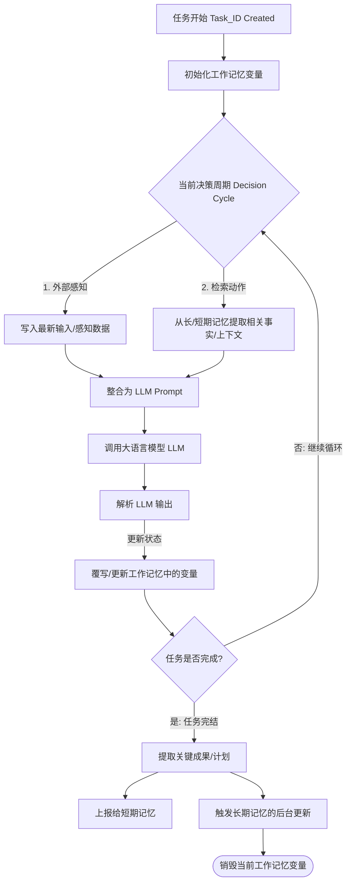
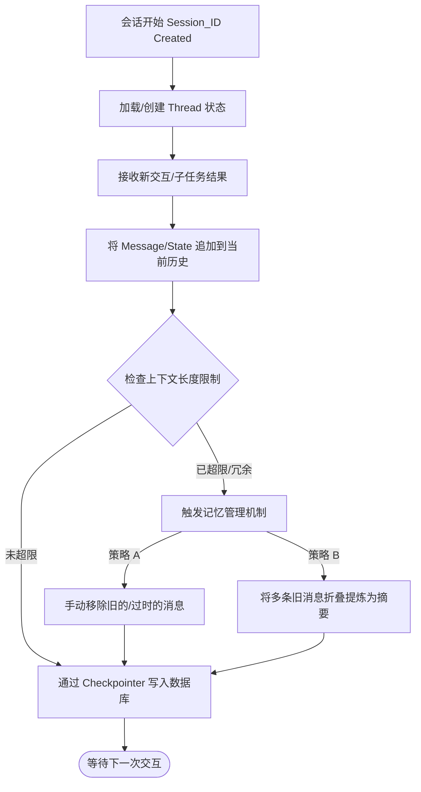
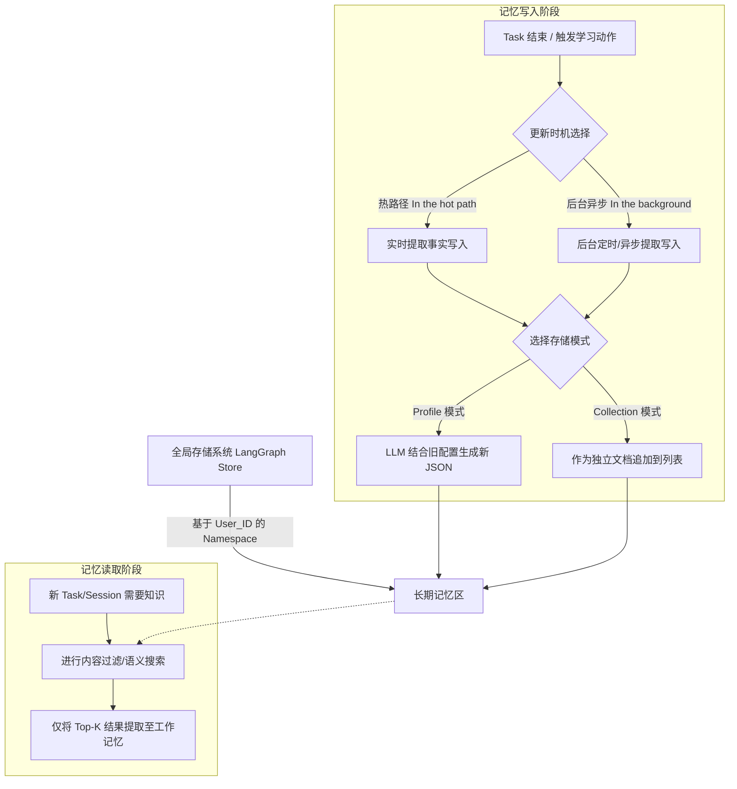

# 智能体多级记忆系统设计文档

> **模块路径**: `ai-engine/src/ai_engine/context/`
> **理论参考**: `CoALA架构：https://arxiv.org/pdf/2309.02427`
> **技术实践参考**: `https://docs.langchain.com/oss/python/concepts/memory`

## 核心目标：
**构建一个多层级、作用域隔离的认知记忆系统，解决大语言模型（LLM）在长周期业务流转中的上下文爆炸、响应延迟及信息丢失等工程痛点。**

## 设计原则
 **存储分层、动态检索、闭环维护**

## 技术要求：
### 技术选型
- LangChain 1.2+
- LangGraph 1.0.5+
- PostgreSQL 用于持久化
- Elasticsearch （可选）

### 实现要求 
1. 基于 State决策周期的工作时记忆管理  -> by task_id
2. 基于 checkpointer + PostgresSaver 的短期记忆管理 -> by session_id
3. 基于 Store (Namespace) 的长期记忆管理 -> by user_id

## 架构设计
本系统基于 task_id（任务/工作记忆）、session_id（会话/短期记忆）和 user_id（用户/长期记忆）三层隔离架构进行设计。
- **工作记忆（Working Memory - task_id）:**
定位：作为智能体连接各类组件的中心枢纽，存储当前决策周期内活跃且随时可用的信息。
生命周期：随 task_id 的创建而产生，随任务完结而归档或销毁，一次完整的graph执行，存放在State中,极短。随任务（Decision Cycle）开始而创建，随任务结束而清空或提炼。
数据模型：依赖于图编排（如 LangGraph）的状态（State）字典结构，包含当前感知输入、活跃目标、内部推理生成的变量以及检索到的相关事实。
- **短期记忆（Short-term Memory - session_id）：**
定位：session记忆，用于在单一会话中维持对话的连贯性。
生命周期： 与 session_id 绑定。通过带有线程作用域的检查点（checkpoints）持久化到数据库中
数据模型：基于数据库持久化的消息列表（Message List），包含系统指令、用户输入、模型回复及中间生成的工件（Artifacts）。
- **长期记忆（Long-term Memory - user_id）：**
定位：跨越多个会话共享的全局存储，按自定义命名空间（Namespace）隔离。
生命周期： 在系统中通过自定义的**命名空间（namespaces，例如包含 user_id）**来进行分层存储和隔离，Store 支持跨命名空间的内容过滤（Content filters）和语义搜索（Semantic search），所以Store 的命名空间应该根据“作用域”而非“ID 路径”设计，通过外部向量数据库（PostgreSQL），按自定义命名空间（Namespace，如 user_id/preferences）进行隔离。

子模块拆分：
语义记忆（Semantic Memory）：存储关于用户的客观“事实（Facts）”。落地采用 Profile（配置文件）模式，即一个高密度的 JSON 文档，通过更新键值对来维护最新状态，避免文件无限膨胀。
情景记忆（Episodic Memory）：存储过去成功解决复杂任务的“经验（Experiences）”。落地采用 Collection（文档集合）模式，将每次成功的业务轨迹作为独立文档追加，供后续作为 Few-shot 样例进行语义检索。

我们将记忆分为三层，每一层职责分明：

| 记忆层 | 存储引擎 | 作用域 | 内容 | 核心逻辑 |
| :--- | :--- | :--- | :--- | :--- |
| **短期记忆 (Short-term)** | `PostgresSaver` | `session_id` | 完整的 `messages` 历史 | 用于对话连贯性、断点恢复 |
| **工作记忆 (Working Memory)** | `State` | `task_id` |  | 用于 Plan & Execute 的逻辑驱动，用于决策 |
| **长期记忆 (Long-term)** | `LangGraph Store` | `user_id` | 偏好、关键结论、摘要 | 用于跨会话的智能迁移与上下文扩充 |

### 核心管理与使用规范 (创建/更新/保存/删除与检索/评估)

#### 1 工作记忆 (Working Memory)
*   **管理机制**：
    *   *创建*：在每次图（Graph）被调用或步骤开始时读取与创建。
    *   *更新*：高频读写。在每次 LLM 调用后，将输出解析为变量覆写工作记忆。
    *   *保存与删除*：生命周期极短，用完即弃。步骤完成时状态流转，任务结束后细粒度推理数据被直接丢弃。
*   **使用规范**：
    *   *检索*：作为目标容器，接收从长/短期记忆中拉取的数据。
    *   *评估与选择*：在规划阶段，基于工作记忆当前内容，LLM 模拟并评估多个候选行动的价值，最后选择最优行动执行。

#### 2 短期记忆 (Short-term Memory)
*   **管理机制**：
    *   *创建/保存*：在 `session_id` 首次交互时创建，通过检查点（checkpointer）实时持久化到数据库中，以便随时恢复线程。
    *   *更新*：交替追加人类输入和模型响应。
    *   *删除（修剪）*：必须引入机制手动移除或“遗忘”陈旧的、偏离主题的信息，防止上下文超载。
*   **使用规范**：
    *   *检索*：在每次交互前，作为基础对话历史提供给大模型。

#### 3 长期记忆 (Long-term Memory)
*   **管理机制**：
    *   *创建/更新时机*：分为“在热路径中（实时）”和“在后台中（异步）”。强烈建议采用**后台异步更新**，这样可以消除主业务的延迟，且让智能体专注生成高质量记忆而无需在记忆创建和回复用户间多任务切换。
    *   *更新形态*：对于 Profile，传入旧配置让模型生成新配置或 JSON 补丁；对于 Collection，直接生成新对象并插入列表。
    *   *删除 (Unlearning)*：智能体需具备特定的删除或修改列表中现有条目的能力（如主动遗忘）。
*   **使用规范**：
    *   *检索*：必须按需使用。在意图识别阶段即进行检索，并填入上下文。利用命名空间进行内容过滤，并结合向量语义搜索（Semantic search），仅提取与当前任务高度相关的记忆片段。
    *   *评估*：提取的情景经验常作为“少样本提示（few-shot examples）”，模型通过评估这些过往成功序列来指导当前任务的执行。

---

### 记忆修剪与防丢失机制设计 (Memory Pruning & Loss Prevention)

长文本累积会导致 LLM “分心”、响应变慢、成本增加，甚至超出上下文窗口导致不可恢复的错误。因此必须进行修剪，但修剪不能以永久丢失核心数据为代价。

**工程化防丢失修剪策略：**

**策略一：短期记忆的摘要与滑动窗口修剪**
对于基于 `session_id` 的短期消息列表，不直接删除数据库中的原始记录，而是在传入工作记忆（State）前进行拦截。当 Token 数量逼近阈值时（超过10轮次对话）应用修剪技术：手动移除陈旧信息，或者将早期多轮对话交由 LLM 折叠成一段简短的“摘要（Summary）”。这样即释放了上下文窗口，又在摘要中保留了业务语境。

**策略二：长期记忆多使用“集合（Collection）”而非“配置（Profile）”，配置（Profile）仅用于存储事实**
在维护长期记忆时，如果不断将新知识强行融合进一个单一的 Profile（JSON 文件），随着文件变大极易出现生成错误并丢失已有信息。
为了防丢失，对于事件和经验，应采用**文档集合（Collection）模式**。由于每次只需生成并追加范围更窄的独立新对象，LLM 不需要去调和新旧信息的冲突，这使得信息随时间丢失的可能性大大降低，并在下游任务中带来更高的召回率。

**策略三：对 Profile 实施分拆与严格解码（Strict Decoding）**
如果业务强制要求维护用户的单一状态快照（Profile），为了防止 LLM 输出格式崩溃导致数据损坏或丢失，必须将庞大的 Profile 拆分为多个更小、领域特定的文档。同时，在让模型根据旧配置生成新配置时，必须启用**严格解码（Strict decoding）**，以确保生成的记忆数据模式（Schema）始终保持结构有效。

**策略四：以“检索”代替“加载”，实现无损的上下文修剪**
防止记忆撑爆上下文的最根本机制，是将状态（State）与存储（Store）隔离。长期的事实和经验作为 JSON 文档持久化保存在后台的 Store 中，它们自带命名空间（类似于文件夹层级）。随着系统运行，存储中的数据会无限增长，但这并不会占用 LLM 的上下文。在运行时，系统通过内容过滤和语义搜索，仅将最相关的几条记忆精准检索到工作记忆中。这种“按需读取”机制，在**保留底层数据库 100% 数据完整性**的同时，实现了输入给大模型的上下文的最优修剪。

### 记忆写入：双轨更新机制 (Write & Learning)
AI 智能体向记忆库写入数据（即“学习”动作），采用分离的双轨机制：

*   **轨道一：热路径实时更新 (In the hot path)**
    *   **适用场景**：`session_id` 级别的短期记忆。
    *   **执行方式**：在图编排的每一个 Step 完成时，通过 Checkpointer 自动将 State 持久化到数据库。
    *   **优缺点**：实时性强，新记忆立即可用，但会轻微增加响应延迟。

*   **轨道二：后台异步提炼 (In the background)**
    *   **适用场景**：`user_id` 级别的长期记忆（语义事实与情景经验）。
    *   **执行方式**：当一个 `task_id` 标记为“已完结（Done）”时，不阻塞给用户的回复，而是触发一个后台异步任务。
    *   **处理逻辑**：利用 LLM 启动一个“反思（Reflection）”过程，审视刚刚完成的 `task` 轨迹。
        *   *如果是新事实*：结合旧的 JSON Profile，生成包含新事实的 JSON Patch（例如用户提及了新的职位信息）。
        *   *如果是优质经验*：将其压缩总结为一条独立的经验文档，追加写入情景记忆的 Collection 列表中。

---

##  落地关键难点与应对策略

| 风险/难点 | 发生场景 | 解决方案设计 |
| :--- | :--- | :--- |
| **上下文溢出 (Context Explosion)** | 短期对话不断追加；长期事实全量加载 | **严格隔离**：State 仅放短期对话和检索到的 top-K 长期记忆。**长文本折叠**：超过 Token 阈值时触发摘要节点，用摘要替换早期历史。 |
| **Profile 生成出错** | 后台更新语义记忆（Profile）时 | 要求模型输出严格的 JSON 格式（Strict decoding）；将过于庞大的 Profile 拆分为多个独立领域的 JSON 文档（如分拆为“基本信息”、“工作偏好”）。 |
| **检索召回率低** | 长期经验（Collection）越来越多时 | 引入**混合检索（Hybrid Search）**，结合命名空间的内容过滤（Content filters）和向量语义搜索（Semantic search），确保精准提取当前 Task 所需的经验。 |
| **系统响应卡顿 (Latency)** | 边响应用户边提炼长文本 | **强制异步**：严禁在向用户输出结果前进行长期记忆的归纳，将“执行（Execute）”与“学习（Learning）”解耦为前台与后台进程。 |

## 详细数据维护流程

### 1. 工作记忆 (Working Memory) 数据维护图
**绑定层级：`task_id`（任务/决策周期）**
**生命周期：极短。随任务（Decision Cycle）开始而创建，随任务结束而清空或提炼。**

**数据维护核心说明：**
*   **高频读写，用完即弃**：工作记忆是当前决策周期内的“活动草稿本”。它将外部感知、检索到的长期记忆和内部推理结果维护为符号变量。
*   **上下文合成**：在每次调用 LLM 时，从工作记忆中提取一个子集（例如提示词模板和变量）生成输入，LLM 的输出被解析回变量（例如动作名称和参数），存回工作记忆以供下一步使用。
*   **生命周期终点**：一旦 `task` 完结，这些细粒度的中间推理步骤、临时文档等数据应被丢弃，仅将**最终结论**传递给上一级，以避免无用的细节占用未来的上下文空间。

---

### 2. 短期记忆 (Short-term Memory) 数据维护图
**绑定层级：`session_id`（会话/线程）**
**生命周期：中等。随用户发起的会话开启，维护整个对话线程的上下文，会话结束或超时后归档。**

**数据维护核心说明：**
*   **线程作用域隔离**：短期记忆通过线程 ID（Thread-scoped）对不同会话进行隔离管理，系统通过检查点（Checkpointer）将状态持久化到数据库中。
*   **上下文爆炸的防御重点**：由于大模型的上下文窗口限制，持续追加的对话列表会导致模型“分心”（响应变慢、成本上升、偏离主题）。
*   **主动遗忘与折叠**：维护短期记忆的核心在于**做减法**。必须引入手动删除陈旧信息（Prune）或滚动总结（Summarize）的机制，始终保持当前 `session` 的上下文精简且聚焦。

---

### 3. 长期记忆 (Long-term Memory) 数据维护图
**绑定层级：`user_id`（全局命名空间）**
**生命周期：长期/永久。跨越所有会话共享，随时可被检索，持续增量更新。**

**数据维护核心说明：**
*   **跨越线程的共享**：长期记忆存放在自定义命名空间（如包含 `user_id` 的目录）中，作为 JSON 文档持久化。它包括语义记忆（事实）、情景记忆（经验）
*   **写入时机 (Hot path vs Background)**：
    *   *在热路径中（运行时）*：好处是新记忆可以立即用于后续交互，但要求智能体多任务处理，可能增加延迟并影响核心任务的质量。
    *   *在后台（异步）*：更推荐的维护方式。它消除了主程序的延迟，让智能体专注于任务，后台进程再通过分析（如反思 Reflexion）将提炼的知识写入数据库。
*   **形态与维护策略的权衡**：
    *   **Profile（配置文件）**：维护一个包含键值对的单一 JSON 文档。维护时需要传入旧配置生成新配置（更新覆盖），能保证数据高密度，但文件变大后大模型容易出错。
    *   **Collection（文档集合）**：不断追加新文档（如追加新的情景经验）。好处是信息不易丢失且容易生成；维护难点在于模型必须承担修改、删除旧项以及进行“检索（Search）”的复杂性。检索（而不是全量加载）是防止长期记忆引发上下文爆炸的根本手段。
